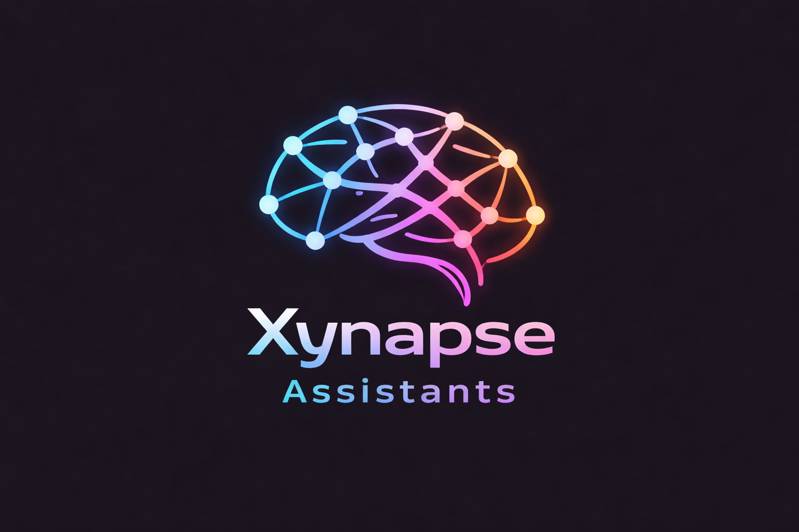
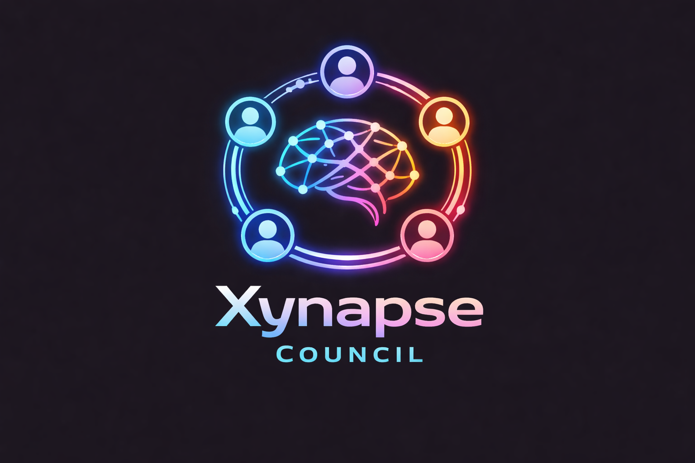

<div align="center">


# Xynapse IDE

**AI-Powered Development Environment**

</div>

---

## About

Xynapse IDE is a desktop development environment with deeply integrated AI capabilities. It combines a full-featured code editor with an intelligent assistant, inline code completion, and a multi-agent planning system called Council.

<div align="center">

</div>

## Key Features

### Xynapse Assistant

The built-in AI assistant lives in the sidebar and provides:

- **Chat** — ask questions, get explanations, generate code
- **Edit & Apply** — select code, describe changes, apply them directly
- **Slash Commands** — quick actions via `/command` syntax
- **Multi-Provider Support** — connect any LLM provider (OpenAI, Anthropic, Google, YandexGPT, local models, and more)
- **Model Roles** — assign different models for chat, edit, apply, autocomplete, and summarize tasks
- **Context Awareness** — the assistant understands your codebase structure

### Xynapse Autocomplete

Inline code completion powered by a self-hosted engine:

- Real-time suggestions as you type
- Works with local or remote completion servers
- Configurable trigger behavior and model selection

### Xynapse Council

<div align="center">

</div>

A multi-agent planning system where AI experts collaborate on your task:

- **Configurable Roles** — Architect, Developer, Reviewer, Tester, or create custom roles
- **Per-Role Model Selection** — assign different AI models to each agent
- **Difficulty Levels** — Easy (1 round), Medium (3 rounds), Hard (5 rounds)
- **Structured Output** — generates `council-plan.md` with file structure, implementation steps, and technology choices
- **Discussion Log** — optionally saves the full agent discussion to `council-discussion.md`

Usage: click the Council button in the input toolbar or type `/council [task]`

## Themes

Xynapse ships with 14 built-in themes:

Lavender Dream, Grape Twilight, Deep Ocean, Cherry Blossom, Sunrise Glow, Frozen Mist, Silent Storm, Midnight Soul, Winter Frost, Shadow Realm, Tokyo Night, Tokyo Night Storm, Tokyo Night Light, Lunar Eclipse Dark

## Quick Start

### Requirements

- Node.js 20.19.0+
- Python 3.10+
- Windows 10/11

### Launch

```powershell
# Clone the repository
git clone https://github.com/jabrailkhalil/Xynapse.git
cd Xynapse

# Use the launcher
xynapse.bat
```

The launcher provides a menu for building, running, development mode, watch modes, release packaging, and more.

### Manual Build

```powershell
cd vscode
npm install
npm run compile
.\scripts\code.bat
```

## Configuration

The assistant is configured via `~/.xynapse/config.yaml`. Add your LLM providers and assign models to roles:

```yaml
models:
  - name: my-model
    provider: openai
    model: gpt-4
    apiKey: YOUR_KEY
    roles:
      - chat
      - edit
```

A reference config template is included at `vscode/extensions/xynapse-assistant/xynapse-config.yaml`.

## Editor Defaults

- Tab size: 2
- Smooth scrolling enabled
- Minimap disabled
- Word wrap at column 100
- Font stack: JetBrains Mono, PragmataPro
- Terminal font: PragmataPro Liga

## Project Structure

```
Xynapse/
├── vscode/                     # IDE core
│   ├── extensions/
│   │   ├── xynapse-assistant/  # Built-in AI assistant extension
│   │   └── theme-xynapse-extras/ # Xynapse themes
│   └── scripts/                # Launch scripts
├── vscode/extensions/xynapse-assistant/  # AI assistant (built)
├── Pics/                       # Documentation images
├── xynapse.bat                 # Windows launcher
└── README.md
```

## License

MIT
