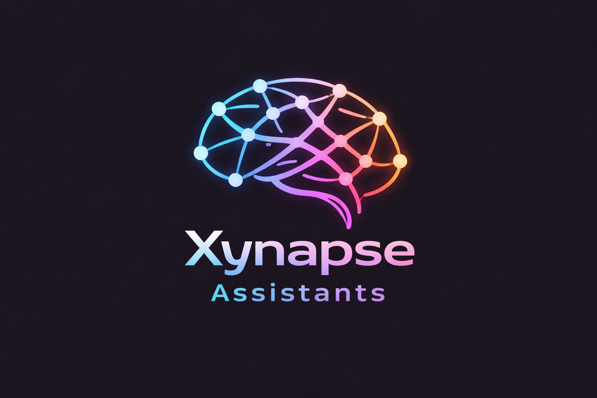
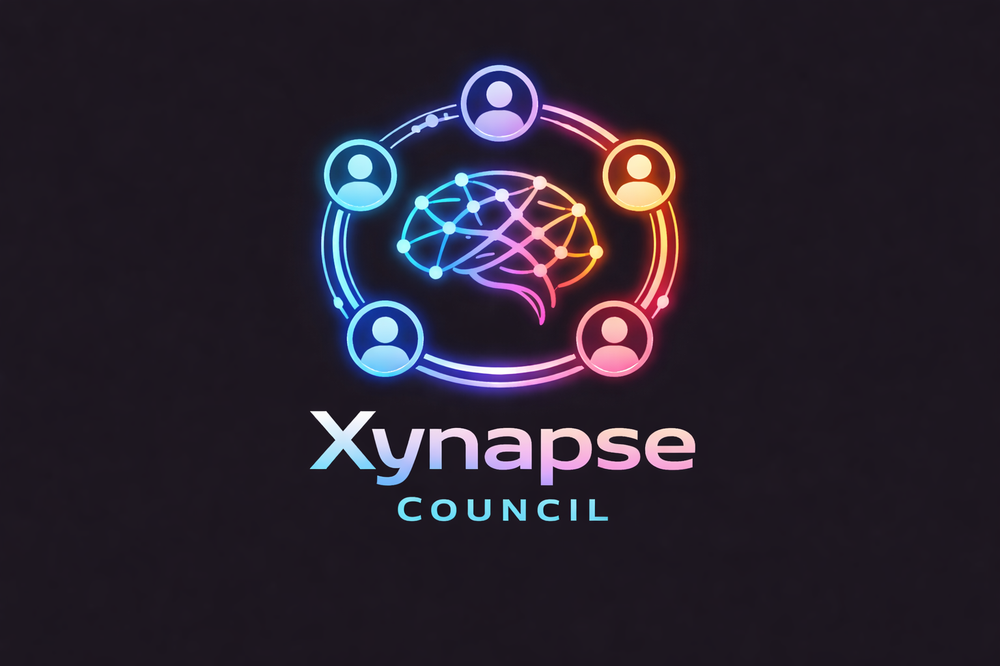

<div align="center">


# Xynapse IDE

**The Next Generation of AI-Powered Development**

A complete development environment with deeply integrated artificial intelligence —
not a plugin, not an add-on, but a unified system where AI is built into every layer of the editor.

**Project website:** [xynapse.online](https://xynapse.online)

</div>

---

## What is Xynapse IDE

Xynapse IDE is a desktop development environment built on Electron/TypeScript, running on a VS Code core and extended with a powerful in-house AI system. Unlike AI plugins that exist separately from the editor, Xynapse integrates intelligence directly into the workflow: the assistant understands the full project context, not just individual files.

**Three core subsystems:**

| Subsystem | Purpose |
|---|---|
| **Xynapse Assistant** | Conversational AI assistant with full project context, inline editing, and slash commands |
| **Xynapse Autocomplete** | Real-time inline code completion running independently from the chat model |
| **Xynapse Council** | Multi-agent planning system — multiple AI experts discuss a task and synthesize a plan |

<div align="center">

</div>

---

## Xynapse Assistant

The built-in AI assistant lives in the sidebar and works as a full-fledged co-author of your code.

### Interaction Modes

**Chat** — ask questions in natural language. The assistant sees:
- Open files and selected code fragments
- The full project file structure
- Terminal output and error list
- Git diff of current changes

**Edit & Apply** — select any code fragment, describe what needs to change. The assistant generates a diff and applies it directly in the editor with one click. No copy-pasting.

**Slash Commands** — quick actions right from the input field:

| Command | Action |
|---|---|
| `/edit` | Edit selected code |
| `/explain` | Explain code |
| `/comment` | Add comments |
| `/test` | Generate tests |
| `/council` | Launch multi-agent planning |

**Context Menu** — right-click any code fragment for AI actions: commenting, documentation, error fixing, optimization, grammar correction.

### Model Role System

Xynapse doesn't limit you to one model for everything. Each task can use a separate model optimized specifically for it:

| Role | Purpose |
|---|---|
| `chat` | Primary dialogue and questions |
| `edit` | Code editing (inline changes) |
| `apply` | Applying proposed changes |
| `autocomplete` | Inline code completion |
| `summarize` | Summarizing long contexts |
| `embed` | Vector representation for codebase search |
| `rerank` | Re-ranking search results |

This allows, for example, using a fast lightweight model for autocomplete and a powerful one for chat — no compromise between speed and quality.

### Supported LLM Providers

Xynapse supports any OpenAI-compatible provider, plus specialized integrations:

**Russian providers (native support):**
- **YandexGPT** — native Yandex Cloud integration with folderId and IAM tokens
  - YandexGPT Pro, YandexGPT Lite, YandexGPT 32K
  - Llama 3.1 8B (Yandex), Llama 3.1 70B (Yandex)
- **GigaChat** (Sber) — native integration with OAuth authorization and Russian Trusted Root CA
  - GigaChat, GigaChat-2, GigaChat Plus
  - GigaChat Pro, GigaChat-2 Pro
  - GigaChat Max, GigaChat-2 Max

**International providers:**
- OpenAI (GPT-4, GPT-4o, o1, o3)
- Anthropic (Claude 3, Claude 4)
- Google (Gemini 1.5, Gemini 2.0)
- Mistral AI
- Groq (ultra-fast inference)
- Together AI, Fireworks AI, Replicate
- Ollama, LMStudio, llama.cpp (local models)
- Azure OpenAI, AWS Bedrock, Google Vertex AI
- Novita AI, Cerebras, DeepInfra, Nebius
- Any OpenAI-compatible endpoint

---

## Multilingual Interface

Xynapse supports **16 languages** for both the IDE and assistant:

🇷🇺 Russian, 🇺🇸 English, 🇪🇸 Spanish, 🇫🇷 French, 🇩🇪 German, 🇨🇳 Chinese, 🇯🇵 Japanese, 🇰🇷 Korean, 🇧🇷 Portuguese, 🇮🇹 Italian, 🇹🇷 Turkish, 🇺🇦 Ukrainian, 🇵🇱 Polish, 🇸🇦 Arabic, 🇮🇳 Hindi, 🇳🇱 Dutch

- **IDE Language** (globe icon in status bar) — switches the editor interface language
- **Assistant Language** (chat icon in status bar) — switches AI response language, rules, context prompts, and slash command descriptions

When changing the assistant language, rules, context prompts, slash command descriptions, and the `responseLanguage` directive in config are all updated automatically. Config reloads instantly — no window restart needed.

---

## Xynapse Autocomplete

Line completion system — inline code completion runs in parallel with the assistant and doesn't interfere with the chat.

- **Real-time** — suggestions appear as you type, with no visible latency
- **Separate model** — autocomplete uses its own model with the `autocomplete` role, independent of the chat model
- **Configurable trigger** — control delay, minimum request length, and display conditions
- **Tab acceptance** — accept the full suggestion with Tab

---

## Encrypted Config Backup

Xynapse uses local accounts — no cloud login required. To transfer configuration between PCs:

- **Export** (`Ctrl+Shift+P` → "Xynapse: Export Encrypted Config Backup") — bundles `config.yaml`, `config.json`, `profile.json` into a single `.enc` file, encrypted with AES-256-GCM + PBKDF2
- **Import** (`Ctrl+Shift+P` → "Xynapse: Import Encrypted Config Backup") — decrypts and restores configuration
- **Git sync** — the `.enc` file can be stored in any git repo for cross-machine synchronization

---

## Updates via GitHub Releases

Xynapse supports manual in-app updates on Windows through GitHub Releases.

### How it works

1. The user clicks `Help -> Check for Updates`.
2. Xynapse requests `releases/latest` for the repository configured in `vscode/product.json`.
3. The release tag or title is parsed as a semantic version and compared with the currently running application version.
4. The updater selects the correct Windows asset for the current install type: setup installs use a `.exe` installer for `user` or `system`, while archive installs use `.zip`, `.7z`, `.tar.gz`, or `.tgz`.
5. For setup installs, Xynapse downloads the installer to a temporary update cache and reuses the existing Windows apply/restart flow.
6. For archive installs, Xynapse exposes the release asset as a downloadable update link.

### Release requirements

- Publish a GitHub Release with a semantic version tag such as `v1.108.1`.
- Attach Windows assets for the builds you want to distribute.
- The updater can use explicit asset names from product configuration, but it also falls back to matching by install type, architecture, and naming hints such as `user`, `system`, `setup`, `portable`, or `archive`.

---

## Xynapse Council

<div align="center">

</div>

Xynapse Council is a multi-agent planning system where a task isn't just solved by one model, but discussed by a team of specialized AI experts. The result is a weighted plan with explicitly resolved conflicts.

Formalization source: [thesis chapter 2](./диплом/bachelor-thesis-template-master/parts/chapter2.tex) and [full BVC appendix](./диплом/bachelor-thesis-template-master/parts/appendix-bvc.tex).

### Algorithm: 3-Phase Discussion

**Phase 1: Independent Analysis**

Each agent receives the task and analyzes it independently, without seeing other agents' responses. This eliminates the "first speaker" effect — no agent influences others' opinions at the initial stage.

Each agent's response format:
```
## Proposal         — concrete solution to the task
## Risks            — potential problems and bottlenecks
## Key Decisions    — technical decisions requiring discussion
```

**Phase 2: Cross-Critique** (0–2 rounds depending on difficulty)

Each agent sees ALL responses from previous phases and must critically evaluate them. The agent doesn't just agree or disagree — it proposes specific changes.

Response format:
```
## Agree            — what's correct in other proposals
## Disagree         — specific objections with reasoning
## Suggest Changes  — concrete alternatives
```

**Phase 3: Plan Synthesis**

The planner receives the full discussion history and synthesizes the final plan, explicitly resolving all conflicts between agents.

```
## Disputed Decisions — list of conflicts and how they were resolved
## Final Plan         — step-by-step implementation plan
## File Structure     — specific files and their purpose
```

### LLM Call Count by Difficulty

| Difficulty | Phase 1 | Phase 2 (critique rounds) | Total calls |
|------------|---------|---------------------------|-------------|
| Easy | N agents | 0 rounds | N + 1 |
| Medium | N agents | 1 round | 2N + 1 |
| Hard | N agents | 2 rounds | 3N + 1 |

With 4 agents at hard difficulty: **13 LLM calls** with full discussion tracing.

### BVC Mathematical Model

In the thesis, Council is formalized as **Budgeted Verified Council (BVC)**: for a codebase $S_0$ and user task $x$, the system must produce a final patch $\Delta_{\text{final}}$ such that

$$
\mathrm{Verify}(S_0 \oplus \Delta_{\text{final}})=\text{pass}, \qquad b \le B,
$$

where $B$ is the budget of generative LLM calls and $b$ is the number already spent.

The formal model introduces a role set $\mathcal{R}$ and a fixed planning-axis set $T_0$:
`{root_cause_location, fix_strategy, dependencies_to_update, test_coverage}`.
Each role $r \in \mathcal{R}$ returns a structured decision

$$
a_r:T_0 \to \{\text{strings}\}\cup\{\text{NA}\}\cup\{\bot\},
$$

where `NA` means an explicitly inapplicable axis and $\bot$ means no valid value was produced for that axis.

For each axis $t$, the model computes the valid-role set $\mathcal{R}_t=\{r \in \mathcal{R}: a_r(t)\neq \bot\}$ and its size $m_t=|\mathcal{R}_t|$. After canonicalization, two independent disagreement metrics are used:

For $m_t \ge 2$:

$$
d_{\text{vote}}(t)=\frac{1-\max_{\ell}\hat{p}_{t,\ell}}{1-\frac{1}{m_t}},
\qquad
\hat{p}_{t,\ell}=\frac{1}{m_t}\sum_{r \in \mathcal{R}_t}\mathbf{1}[\tilde a_r(t)=\ell].
$$

For $m_t \le 1$, define $d_{\text{vote}}(t)=0$.

$$
d_{\text{cov}}(t)=1-\frac{m_t}{R}, \qquad
D_{\text{vote}}=\frac{1}{|T_{\ge 2}|}\sum_{t \in T_{\ge 2}} d_{\text{vote}}(t), \qquad
D_{\text{cov}}=\frac{1}{|T_0|}\sum_{t \in T_0} d_{\text{cov}}(t),
$$

where $T_{\ge 2}=\{t \in T_0 : m_t \ge 2\}$ is the set of axes with at least two meaningful votes. $D_{\text{vote}}$ measures substantive disagreement between agents, while $D_{\text{cov}}$ measures degradation caused by missing or unparseable structured outputs.

The critique phase continues only while all of the following remain true:

$$
T_{\ge 2}\neq\varnothing,\quad
D_{\text{cov}}\le\tau_{\text{cov}},\quad
D_{\text{vote}}>\tau_{\text{vote}},\quad
k<K_{\max},\quad
b+|\mathcal{R}|+B_{\text{res}}\le B.
$$

That is the core “budgeted verified” idea: discussion stops not only when consensus is reached, but also when coverage degrades or when continuing would violate the safe budget reserve. In the current Xynapse implementation, the practical values are $K_{\max}=2$, $B_{\text{res}}=2$, $\tau_{\text{vote}}=0.3$, $\tau_{\text{crit}}=0.7$, and $\tau_{\text{cov}}=0.7$.

From the call-budget perspective, the upper bound is

$$
N_{\text{LLM}}^{\max}\le \min\bigl(B,\; R(1+K_{\max})+1+P_{\max}\bigr),
$$

where $P_{\max}$ is the limit for verified repair attempts after plan synthesis. For the planning stage itself, the Council call count is $N_{\text{LLM}}=R+K\cdot R+1$, which is why the current budgets for $R=4$ are `easy = 5`, `medium = 9`, and `hard = 13`.

### Project Context

Before the discussion begins, Council automatically collects project context:
- **File tree** (depth 2, filtered by `.gitignore`)
- **README** (up to 2000 characters)
- **Dependency files** (`package.json`, `Cargo.toml`, `requirements.txt`, etc., up to 3000 characters)

Context is injected into each agent's system message — they know which project they're working with.

### Configurable Agent Roles

By default, Council uses 4 roles:

| Role | Specialization |
|---|---|
| **Architect** | System design, project structure, technology stack |
| **Developer** | Concrete implementation, algorithms, code patterns |
| **Reviewer** | Code quality, security, performance, best practices |
| **Tester** | Testability, edge cases, integration scenarios |

Roles are fully customizable: create any number of agents with arbitrary specializations.

### Per-Role Model Assignment

Each Council agent can use a separate AI model. For example:
- Architect → GPT-4o (architectural thinking)
- Developer → Claude Sonnet (implementation)
- Reviewer → Gemini (code analysis)
- Tester → YandexGPT (testing)

### Output Files

- **`council-plan.md`** — final implementation plan (opened automatically)
- **`council-discussion.md`** — full phase-by-phase discussion log (optional)

### Usage

```
/council Implement a JWT authentication system with refresh tokens
```

Or click the Council button in the assistant's input toolbar.

---

## Architecture

### Data Flow: Config → Backend → Interface

```
~/.xynapse/config.yaml
    → loadYaml.ts      — YAML parsing, role expansion
    → models.ts        — BaseLLM instance creation from config
    → load.ts          — serialization by role for frontend
    → core.ts          — delivery via postMessage to webview
    → ParallelListeners.tsx — reception on the GUI side
    → Redux store      — configuration state
    → ModelSelect.tsx  — model list rendering
```

### System Layers

```
┌─────────────────────────────────────────┐
│              VS Code Editor             │  ← Electron/TypeScript core
├─────────────────────────────────────────┤
│         Extension Host Process          │  ← Node.js extension process
│   XynapseGUIWebviewViewProvider         │
│   XynapseConsoleWebviewViewProvider     │
├─────────────────────────────────────────┤
│            Xynapse Core                 │  ← Assistant backend
│   LLM Router → BaseLLM providers        │
│   Config YAML → Model role mapping      │
│   Slash commands (council, edit, ...)   │
│   Context providers (code, diff, ...)   │
├─────────────────────────────────────────┤
│            Xynapse GUI                  │  ← React/Vite webview
│   Chat interface → Redux state          │
│   Model selector → Role-based display   │
│   Council dialog → Phase streaming      │
└─────────────────────────────────────────┘
```

---

## Themes

14 built-in themes designed specifically for Xynapse:

| Theme | Style |
|---|---|
| **Lavender Dream** | Soft dark lavender |
| **Grape Twilight** | Deep purple-dark |
| **Deep Ocean** | Blue deep-sea |
| **Cherry Blossom** | Warm burgundy-dark |
| **Sunrise Glow** | Light golden-orange |
| **Frozen Mist** | Cold grey-blue dark |
| **Silent Storm** | Minimalist dark grey |
| **Midnight Soul** | Deep night dark |
| **Winter Frost** | Light cold white |
| **Shadow Realm** | Ultra-dark near-black |
| **Tokyo Night** | Classic Tokyo Night palette |
| **Tokyo Night Storm** | Tokyo Night with blue tint |
| **Tokyo Night Light** | Light version of Tokyo Night |
| **Lunar Eclipse Dark** | Dark lunar with purple |

Plus **Material Icon Theme** is built in as a standard extension — file icons from 900+ mapping rules are active by default.

---

## Configuration

The assistant is configured via `~/.xynapse/config.yaml`. Full example:

```yaml
name: "My Config"
version: "1.0.0"

models:
  # Primary model for chat
  - name: "GPT-4o"
    provider: "openai"
    model: "gpt-4o"
    apiKey: "sk-..."
    roles:
      - chat
      - edit
      - apply

  # Fast model for autocomplete
  - name: "YandexGPT Lite"
    provider: "yandex_gpt"
    model: "yandexgpt-lite"
    apiKey: "AQVN..."
    roles:
      - autocomplete
    requestOptions:
      extraBodyProperties:
        folderId: "your-folder-id"

  # Powerful model for summarizing large contexts
  - name: "Claude Sonnet"
    provider: "anthropic"
    model: "claude-sonnet-4-6"
    apiKey: "sk-ant-..."
    roles:
      - summarize

rules:
  - "You are Xynapse Assistant, an intelligent development helper."
  - "When creating files, always use a path relative to the project root."

context:
  - provider: "code"
  - provider: "diff"
  - provider: "terminal"
  - provider: "problems"
  - provider: "codebase"
```

Reference config template: `vscode/extensions/xynapse-assistant/xynapse-config.yaml`

---

## Quick Start

### Requirements

- Node.js 20.19.0+ (LTS)
- Python 3.10+
- Windows 10/11

### Launch via Launcher

```powershell
git clone https://github.com/jabrailkhalil/Xynapse.git
cd Xynapse
xynapse.bat
```

The launcher provides an interactive menu: build, run, dev mode, watch modes, release packaging.

### Manual Build

```powershell
cd vscode
npm install
npm run compile
.\scripts\code.bat
```

### Release Build (Win64)

```powershell
cd vscode
npm run gulp vscode-win32-x64
# Output: .build/VSCode-win32-x64/
```

---

## Editor Defaults

Xynapse ships with a pre-configured developer profile:

- **Font**: JetBrains Mono, PragmataPro — ligatures, sharpness, readability
- **Terminal font**: PragmataPro Liga
- **Tab size**: 2 spaces
- **Word wrap**: column 100
- **Smooth scrolling**: enabled
- **Minimap**: disabled (more room for code)
- **Icons**: Material Icon Theme by default

---

## Project Structure

```
Xynapse/
├── vscode/                          # IDE core (Electron/TypeScript)
│   ├── src/                         # VS Code source code
│   ├── extensions/
│   │   ├── xynapse-assistant/       # AI assistant (compiled)
│   │   │   ├── out/extension.js     # Extension host backend
│   │   │   ├── gui/                 # React/Vite webview UI
│   │   │   ├── xynapse-config.yaml  # Configuration template
│   │   │   └── package.json         # Extension manifest
│   │   ├── theme-xynapse-extras/    # 14 built-in themes
│   │   │   └── themes/              # Theme JSON files
│   │   └── material-icon-theme/     # Material icons (built-in)
│   └── scripts/                     # IDE launch scripts
├── Pics/                            # Documentation images
├── xynapse.bat                      # Windows launcher
└── README.md
```

---

## License

MIT
