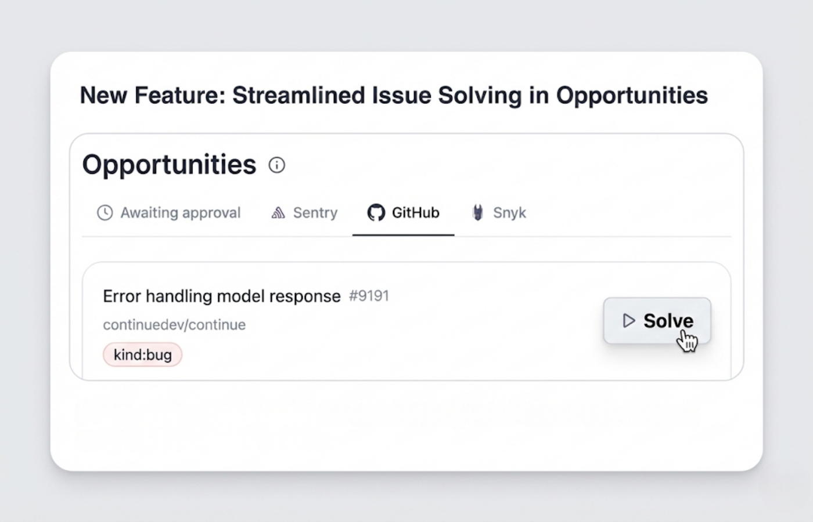

<Update label="December 2025">
## **Discover Opportunities You Can Hand Off: Introducing Proactive Cloud Agents**

Over the past month, we’ve moved beyond just helping you code. We’ve been laying the groundwork to make Xynapse an always-on partner that handles the tasks you’d rather not do yourself.

The result is a shift in how you interact with Xynapse: less setup, less context switching, and more automation driven directly from your workflow.

[Xynapse Integrations](https://hub.xynapse.dev/integrations) can now surface actionable work from tools you already rely on. Instead of hunting for issues, Sentry alerts, Snyk vulnerabilities, and GitHub Issues are brought to you as "Opportunities" that you can immediately delegate to an agent for a first pass, and then you can review or approve the results.

<iframe
  className="w-full aspect-video rounded-xl"
  src="https://www.youtube.com/embed/WR76-SMaaxc?si=9YNb464zgU4ZtX8n"
  title="YouTube video player"
  allow="accelerometer; autoplay; clipboard-write; encrypted-media; gyroscope; picture-in-picture"
  allowFullScreen
></iframe>

### **Automate Your Workflows with Cloud Agents**

You can now automate workflows across tools like [PostHog](https://hub.xynapse.dev/integrations/posthog), [Supabase](https://hub.xynapse.dev/integrations/supabase), [Netlify](https://hub.xynapse.dev/integrations/netlify), [Atlassian](https://hub.xynapse.dev/integrations/atlassian), and [Sanity](https://hub.xynapse.dev/integrations/sanity) using cloud agents.

Instead of manually stitching together dashboards, alerts, and follow-up tasks, Xynapse cloud agents can monitor signals, take action, and push work forward automatically. This makes Xynapse useful not just for coding tasks, but for the operational work that surrounds shipping software.

Cloud agents are designed to run continuously and reliably, which is why much of the recent work focused on session stability, execution reliability, and onboarding improvements.

### **Trigger Agents from Slack and GitHub**

You can now kick off cloud agents directly from [Slack](https://hub.xynapse.dev/integrations/slack) and [GitHub](https://hub.xynapse.dev/integrations/github) using @Xynapse.

Now, you can kick off cloud agents directly where your team is already talking. Just mention @Xynapse in a Slack thread or a GitHub comment. The agent will pick up the immediate context and follow your directions, letting you stay in your flow.

</Update>